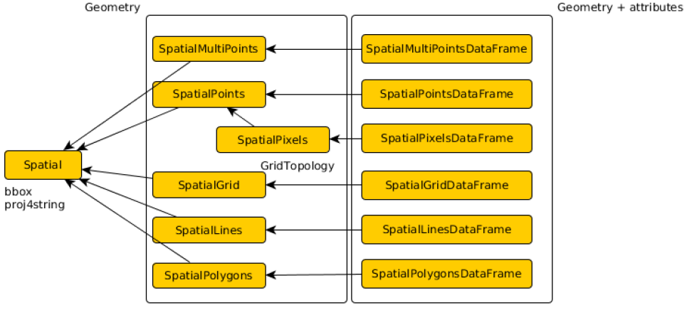

```{r setup, include=TRUE}
```

## Inhalt

- sp package und räumliche Datentypen
- Beispieldatensatz MEUSE - Schwermetallkonzentrationen im Mutterboden einer Flussaue
- Graphische Darstellungen
- Interpolationsmethoden

## Motivation

- MEUSE ein klassikler Geostatistikdatensatz und wurde auch im Kurs DAT203.3x Applied Machine Learning (EDX.org) verwendet.

## sp package und räumliche Datentypen {.smaller}

- sp liefert Klassen und Methoden um Punkte, Linien, Polygone und Grids zu erstellen und zu bearbeiten.
- Die 'Spatial' Klasse ist die fundamentale Klasse aller räumlichen Datentypen in sp.

```{r, out.width = "800px"}

```

## Laden der Libraries

```{r Libraries}
library(sp)
library(leaflet)
library(gstat)
library(ggplot2)
```


## MEUSE Datensatz {.smaller}
### Beschreibung

- Gemessene Schweremetallkonzentrationen im Mutterboden einer Flussaue
- Sowie weitere Boden- und Landschaftseigenschaften
- Fluss Meuse nahe dem Dorf Stein (Niederlande)

- Koordinatensystem:  EPSG:28992 (Amersfoort/RD New)

### Laden der Daten

```{r Laden Libraries Daten, echo=TRUE}
# data loading
data("meuse")
class(meuse)
data("meuse.grid")
class(meuse.grid)
```

### MEUSE - Daten Summary {.smaller}

```{r Daten Summary MEUSE, echo=TRUE}
summary(meuse)
```

### MEUSE.GRID - Daten Summary {.smaller}

```{r Daten Summary MEUSE.GRID, echo=TRUE}
summary(meuse.grid)
```

## MEUSE - Erstellen der Räumlichen Daten {.smaller}

```{r, echo=TRUE}
# creating spatial data
coordinates(meuse) <- ~x+y # Use x and y as coordinate
coordinates(meuse.grid) = ~x+y
# set spacial reference used in the meuse data
proj4string(meuse) <- CRS("+init=epsg:28992") 
proj4string(meuse.grid) <- CRS("+init=epsg:28992")
gridded(meuse.grid) = TRUE

class(meuse)
class(meuse.grid)
```


## MEUSE - Darstellung der Bleikonzentration

```{r MEUSE Lead , fig.height = 5, fig.width = 7}

spplot(meuse, "lead", do.log = TRUE,
	key.space=list(x=1.05,y=0.9,corner=c(0,1)),
	scales=list(draw=T),
	main = "Bleikonzentration [ppm]")

```

## MEUSE - Interaktive Darstellung {.smaller}

### Transformation zu WGS84

- Openstreet-Basemap ist in WGS84

```{r}
WGS84 <- CRS("+proj=longlat +ellps=WGS84")
meuse.wgs84 <- meuse
meuse.wgs84 <- spTransform(meuse.wgs84, WGS84)
```

### Darstellung

- Latitude, Longitude Darstellung (WGS84)

```{r}
colpal <- colorBin("Reds", bins = 5, domain = range(meuse.wgs84$lead))
colopa <- 0.5
my_map <- meuse.wgs84 %>%
    leaflet() %>%
    addTiles() %>%
    addScaleBar(position = c("bottomleft")) %>%
    addCircleMarkers(radius = ~ sqrt(lead / 2 / pi) * 1.0,
                     weight = 2,
                     fillColor = ~ colpal(lead),
                     fillOpacity = colopa,
                     popup = ~ sprintf('Cadmium:%.1f<br>
                                        Kupfer:%.1f<br>
                                        Blei: %.1f<br>
                                        Zink:%.1f
                                       ',
                                     cadmium,
                                     copper,
                                     lead,
                                     zinc
                                     )
                     ) %>%
    addLegend("bottomright", pal = colpal, values = ~lead,
              title = "Blei [ppm]",
              opacity = colopa
    ) %>%
    addControl("<b>Bleikonzentration im Mutterboden</b>",
               position = "toprigh")

my_map
```

## MEUSE.GRID - Abstand zum Fluss {.smaller}

- Diese Daten werden bei den Interpolationen vewendet.

```{r Grid Data Example Plot, fig.height = 5, fig.width = 7}
spplot(meuse.grid, z="dist",
       scales=list(draw=T),
       main = "Normalisierter senkrechter Abstand zum Fluss")
```

## Interpolation - IDW  {.smaller}

- IDW (Inverse Distanzgewichtung) basiert auf der Annahme, dass die Interpolation von nahen Punkten mehr beeinflusst sein sollte als von weiter entfernten Punkten. Sie ist eine der meist verwendeten Interpolationstechniken.

```{r IDW Calc, echo=TRUE, results='hide'}
# Apply the inverse distance weighted interpolation
lead.idw = idw(lead~1, meuse, meuse.grid)
```

```{r IDW PLot, fig.height = 5, fig.width = 7}
class(lead.idw)
spplot(lead.idw["var1.pred"], scales=list(draw=T),
       main = "IDW: Interpolierte Bleikonzentration [ppm]")
```


## Beziehung zwischen Bleikonzentration und Abstand {.smaller}

```{r,echo=TRUE, fig.width=5, fig.height=2.75}
ggplot(data.frame(meuse), aes(dist, lead)) + 
  geom_point(size = 2, color = 'blue', alpha = 0.3)+
  ggtitle('Bleikonzentration vs. Abstand') +
  ylab('Bleikonzentration [ppm]') +
  xlab('Normierter Abstand vom Fluss')

meuse$sqrtDist = sqrt(meuse$dist)
meuse$logLead = log(meuse$lead)
ggplot(data.frame(meuse), aes(sqrtDist, logLead)) + 
  geom_point(size = 2, color = 'blue', alpha = 0.3)+
  ggtitle('Log. Bleikonzentration vs. Quadratischer Abstand') +
  ylab('Log. Bleikonzentration') +
  xlab('Quadratischer Abstand vom Fluss')
```

- Die Beziehung kann linearisiert werden durch Verwendung der logarithmischen Bleikonzentration und des quadratischen Abstands.

## Variogramm  {.smaller}

- Semivariogramm (kurz: Variogramm) stellt die räumliche Beziehung eines Punktes (Regionalisierung) zu Nachbarpunkten dar. (Wikipedia)

```{r Omnidirectional Variogram sqrt-dist, echo=TRUE}
# compute variogram
lead.vgm = variogram(logLead ~ sqrtDist, meuse) 
# fit it to the model (fit method 1, spherical model, psill 0.26, range 900 )
lead.vgm.fit = fit.variogram(lead.vgm, model = vgm(1, "Sph", 900, 0.26))

# get model information
lead.vgm.fit 
```

```{r plot variogram, fig.height = 5, fig.width = 7}
plot(lead.vgm, lead.vgm.fit, main = "Semivarianz: Log. Bleikonzentration vs. Abstand")
```

## Interpolation - Kriging  {.smaller}

- Der Vorteil gegenüber einfacheren Methoden wie beispielsweise der Inversen Distanzgewichtung ist die Berücksichtigung der räumlichen Varianz. (Wikipedia)

```{r Kriging, echo=TRUE,  results='hide'}
lead.kriged = krige(logLead ~ 1, meuse, meuse.grid, model = lead.vgm.fit)
lead.kriged$expVar1.pred <- exp(lead.kriged$var1.pred)

```

```{r, fig.height = 5, fig.width = 7}
# [using ordinary kriging]
spplot(lead.kriged["expVar1.pred"], scales=list(draw=T), main ="Interpolierte Bleikonzentration [ppm]")

spplot(meuse, "lead", do.log = TRUE,
	key.space=list(x=1.05,y=0.9,corner=c(0,1)),
	scales=list(draw=T),
	main = "Blei [ppm]")
```

## SessionInfo {.smaller}
```{r SessionInfo, echo=TRUE}
sessionInfo()
```

## Referenzen/Online Ressourcen  {.smaller}

- Applied Spatial Data Analysis with R, Roger S. Bivand, Edzer Pebesma and V. Gómez-Rubio, UseR! Series, Springer, 2nd ed. 2013, xviii+405 pp., ISBN: 978-1-4614-7617-7
- Handling and Analyzing Spatial, Spatiotemporal and Movement Data, Edzer Pebesma
27 June, 2016: https://edzer.github.io/UseR2016/
- Leafleat und Meuse: http://rpubs.com/pcormeau/meuse
- Variogramm und Kriging: https://cran.r-project.org/web/packages/gstat/vignettes/gstat.pdf
- Übersicht: https://cran.r-project.org/web/views/Spatial.html

### Datensatz
- https://rweb.stat.umn.edu/R/site-library/sp/html/meuse.html
- https://rweb.stat.umn.edu/R/site-library/sp/html/meuse.grid.html

